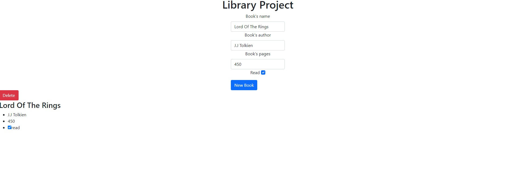

# Library App

> Small Library app for recording a collection of books.



- Has a form to add a book.
- Shows books saved.
- Has a button to remove a book.
- Has a button to change the read status.

## Built With

- Html, CSS, and JavaScript
- Bootstrap

## Live Demo

[Live Demo Link](https://jpdf00.github.io/library-app/)

## Getting Started

To get a local copy up and running follow these simple example steps.

### Install

You can download the code to your personal computer clonig the repository using the following command

```
git clone
```

### Usage

To run this project you only need to open the index.html file in a web browser

## Authors

👤 **Federico Ignacio Lopez Cechini**

- Github: [@FdI96](https://github.com/FdI96)
- Twitter: [@federicolopezc7](https://twitter.com/federicolopezc7)
- Linkedin: [Lopez Cechini Federico Ignacio](https://www.linkedin.com/in/federico-ignacio-lopez-cechini-3285411a4/)

## 🤝 Contributing

Contributions, issues, and feature requests are welcome!

Feel free to check the [issues page](https://github.com/FdI96/LibraryApp/issues).

## Show your support

Give a ⭐️ if you like this project!

## 📝 License

This project is [MIT](./LICENSE) licensed.
